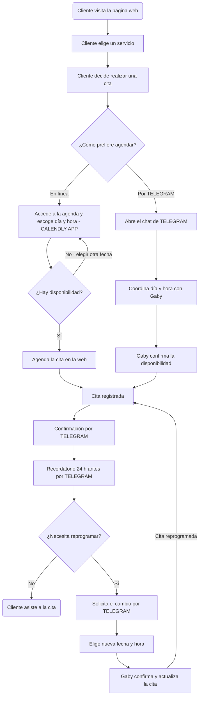

# Flujo — Agendar cita

## Diagrama

## Descripción del flujo

1. **Cliente visita la página web** → elige un servicio → decide realizar una cita.
2. **Decisión — ¿Cómo prefiere agendar?**
   - **En línea:** accede a la agenda (Calendly) y escoge día y hora.
     - **¿Hay disponibilidad?**
       - **Sí:** agenda la cita en la web → *Cita registrada*.
       - **No:** regresa a elegir otra fecha.
   - **Por Telegram:** abre el chat → coordina día y hora con Gaby → Gaby confirma disponibilidad → *Cita registrada*.
3. **Cita registrada** → confirmación por Telegram → recordatorio 24 h antes por Telegram.
4. **Decisión — ¿Necesita reprogramar?**
   - **No:** el cliente asiste a la cita (fin del flujo).
   - **Sí:** solicita el cambio por Telegram → elige nueva fecha y hora → Gaby confirma y actualiza → regresa a *Cita registrada* (cita reprogramada).
